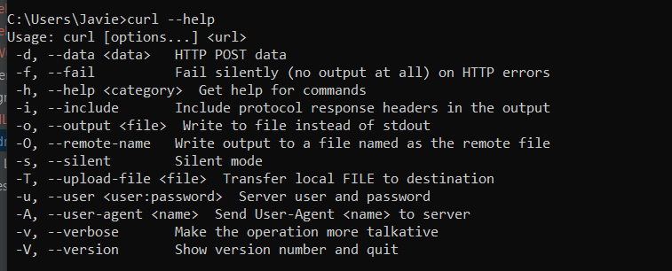
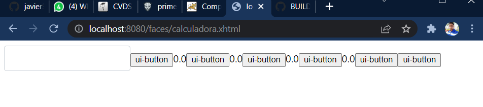

### Francisco Javier Rojas
### Juan Camilo Rojas
# LABORATORIO 5 - MVC PRIMEFACES INTRODUCTION
### TALLER 5

## ESCUELA COLOMBIANA DE INGENIERÍA

### INTRODUCCIÓN A PROYECTOS WEB

---
## PARTE I. - JUGANDO A SER UN CLIENTE HTTP
1) Abra una terminal Linux o consola de comandos Windows.
2) Realice una conexión síncrona TCP/IP a través de Telnet/Netcat al siguiente servidor:
    * Host: www.escuelaing.edu.co
    * Puerto: 80
      Teniendo en cuenta los parámetros del comando telnet:

   telnet HOST PORT
    

3) Antes de que el servidor cierre la conexión por falta de comunicación:
    
    * Revise la página 36 del RFC del protocolo HTTP, sobre cómo realizar una petición GET. Con esto, solicite al servidor el recurso ‘sssss/abc.html’, usando la versión 1.0 de HTTP.
      
      dado que en windows no se ve por eso se uso kali para que se vea la peticion, sin embargo la respuesta es la misma
      
    * Asegúrese de presionar ENTER dos veces después de ingresar el comando.
    * Revise el resultado obtenido. ¿Qué codigo de error sale?, revise el significado del mismo en la lista de códigos de estado HTTP.
      CODIGO 400: correspondiente a un BadRequest
      por parte del cliente
    * ¿Qué otros códigos de error existen?, ¿En qué caso se manejarán?
      tenemos los siguinete codigos
      * 2xx Códigos de éxito
      * 3xx Redirecciones
      * 4xx Error en la petición del cliente
      * 5xx Error interno del servidor
       Mas especificamnte la descripción en está imágen
      
      
4) Realice una nueva conexión con telnet, esta vez a:
    * Host: www.httpbin.org
    * Puerto: 80
    * Versión HTTP: 1.1

   Ahora, solicite (GET) el recurso /html. ¿Qué se obtiene como resultado?
   
   el contenido html de la pagina:
   
   este ser realizo con la version HTTP 1.0 ya que con la 1.1 tenemos una bad request
   como se muestra a continuacion en kali 
   
¡Muy bien!, ¡Acaba de usar del protocolo HTTP sin un navegador Web!. Cada vez que se usa un navegador, éste se conecta a un servidor HTTP, envía peticiones (del protocolo HTTP), espera el resultado de las mismas, y -si se trata de contenido HTML- lo interpreta y dibuja.

5) Seleccione el contenido HTML de la respuesta y copielo al cortapapeles CTRL-SHIFT-C. Ejecute el comando wc (word count) para contar palabras con la opción -c para contar el número de caracteres:

wc -c

Pegue el contenido del portapapeles con CTRL-SHIFT-V y presione CTRL-D (fin de archivo de Linux). Si no termina el comando wc presione CTRL-D de nuevo. No presione mas de dos veces CTRL-D indica que se termino la entrada y puede cerrarle la terminal. Debe salir el resultado de la cantidad de caracteres que tiene el contenido HTML que respondió el servidor.

Claro está, las peticiones GET son insuficientes en muchos casos. Investigue: ¿Cuál es la diferencia entre los verbos GET y POST? ¿Qué otros tipos de peticiones existen?

Con GET me traigo un recurso con POST creo un elemento nuevo

6) En la practica no se utiliza telnet para hacer peticiones a sitios web sino el comando curl con ayuda de la linea de comandos:

   curl www.httpbin.org
   
   

   Utilice ahora el parámetro -v y con el parámetro -i:

   curl -v www.httpbin.org
   
   curl -i www.httpbin.org
   

¿Cuáles son las diferencias con los diferentes parámetros?

como se evidencia en la imagen anterio:

* -v se usa para la informacion sea mas diciente o detallada
* -i nos trae los headers en la res puesta

---
## PARTE II. - HACIENDO UNA APLICACIÓN WEB DINÁMICA A BAJO NIVEL.

En este ejercicio, va a implementar una aplicación Web muy básica, haciendo uso de los elementos de más bajo nivel de Java-EE (Enterprise Edition), con el fin de revisar los conceptos del protocolo HTTP. En este caso, se trata de un módulo de consulta de clientes Web que hace uso de una librería de acceso a datos disponible en un repositorio Maven local.

I. Para esto, cree un proyecto maven nuevo usando el arquetipo de aplicación Web estándar maven-archetype-webapp y realice lo siguiente:

Revise la clase SampleServlet incluida a continuacion, e identifique qué hace:

atiende y reponde peticiones del verbo het bajo la url /helloServlet

En el pom.xml, modifique la propiedad "packaging" con el valor "war". Agregue la siguiente dependencia:

<dependency>
     <groupId>javax</groupId>
     <artifactId>javaee-web-api</artifactId>
     <version>7.0</version>
     <scope>provided</scope>
</dependency>

y agregue la seccion build al final del tag project en el archivo pom.xml:

Revise en el pom.xml para qué puerto TCP/IP está configurado el servidor embebido de Tomcat (ver sección de plugins).

Compile y ejecute la aplicación en el servidor embebido Tomcat, a través de Maven con:

mvn package

mvn tomcat7:run

Abra un navegador, y en la barra de direcciones ponga la URL con la cual se le enviarán peticiones al ‘SampleServlet’. Tenga en cuenta que la URL tendrá como host ‘localhost’, como puerto, el configurado en el pom.xml y el path debe ser el del Servlet. Debería obtener un mensaje de saludo.

Observe que el Servlet ‘SampleServlet’ acepta peticiones GET, y opcionalmente, lee el parámetro ‘name’. Ingrese la misma URL, pero ahora agregando un parámetro GET (si no sabe como hacerlo, revise la documentación en http://www.w3schools.com/tags/ref_httpmethods.asp).

Busque el artefacto gson en el repositorio de maven y agregue la dependencia.

En el navegador revise la dirección https://jsonplaceholder.typicode.com/todos/1. Intente cambiando diferentes números al final del path de la url.

- Con 1

- Con 2

- Con 3

Basado en la respuesta que le da el servicio del punto anterior, cree la clase edu.eci.cvds.servlet.model.Todo con un constructor vacío y los métodos getter y setter para las propiedades de los "To Dos" que se encuentran en la url indicada.

Utilice la siguiente clase para consumir el servicio que se encuentra en la dirección url del punto anterior:

package edu.eci.cvds.servlet;

11. Cree una clase que herede de la clase HttpServlet (similar a SampleServlet), y para la misma sobrescriba el método heredado doGet. Incluya la anotación @Override para verificar –en tiempo de compilación- que efectivamente se esté sobreescribiendo un método de las superclases.

Para indicar en qué URL el servlet interceptará las peticiones GET, agregue al método la anotación @WebServlet, y en dicha anotación, defina la propiedad urlPatterns, indicando la URL (que usted defina) a la cual se asociará el servlet.

Teniendo en cuenta las siguientes métodos disponibles en los objetos ServletRequest y ServletResponse recibidos por el método doGet:

response.setStatus(N); <- Indica con qué código de error N se generará la respuesta. Usar la clase HttpServletResponse para indicar el código de respuesta.
request.getParameter(param); <- Consulta el parámetro recibido, asociado al nombre ‘param’.
response.getWriter() <- Retorna un objeto PrintWriter a través del cual se le puede enviar la respuesta a quien hizo la petición.
response.setContentType(T) <- Asigna el tipo de contenido (MIME type) que se entregará en la respuesta.
Implemente dicho método de manera que:

Asuma que la petición HTTP recibe como parámetro el número de id de una lista de cosas por hacer (todo), y que dicha identificación es un número entero.

Con el identificador recibido, consulte el item por hacer de la lista de cosas por hacer, usando la clase "Service" creada en el punto 10.

Si el item existe:
Responder con el código HTTP que equivale a ‘OK’ (ver referencia anterior), y como contenido de dicha respuesta, el código html correspondiente a una página con una tabla que tenga los detalles del item, usando la clase "Service" creada en el punto 10 par crear la tabla.
Si el item no existe:
Responder con el código correspondiente a ‘no encontrado’, y con el código de una página html que indique que no existe un item con el identificador dado.
Si no se paso parámetro opcional, o si el parámetro no contiene un número entero, devolver el código equivalente a requerimiento inválido.
Si se genera la excepcion MalformedURLException devolver el código de error interno en el servidor
Para cualquier otra excepcion, devolver el código equivalente a requerimiento inválido.
Una vez hecho esto, verifique el funcionamiento de la aplicación, recompile y ejecute la aplicación.

Intente hacer diferentes consultas desde un navegador Web para probar las diferentes funcionalidades.

- Con 1
  
  
- Con 2
  
  
- Con 3
  
  

## PARTE IV. - FRAMEWORKS WEB MVC – JAVA SERVER FACES / PRIME FACES
En este ejercicio, usted va a desarrollar una aplicación Web basada en el marco JSF, y en una de sus implementaciones más usadas: PrimeFaces.

Escriba una aplicación web que utilice PrimeFaces para calcular la media, la moda, la desviación estándar y varianza de un conjunto de N números reales. Este conjunto de N números reales deben ser ingresados por el usuario de manera que puedan ser utilizados para los cálculos.

Al proyecto Maven, debe agregarle las dependencias mas recientes de javax.javaee-api, com.sun.faces.jsf-api, com.sun.faces.jsf-impl, javax.servlet.jstl y Primefaces (en el archivo pom.xml).

Para que configure automáticamente el descriptor de despliegue de la aplicación (archivo web.xml), de manera que el framework JSF se active al inicio de la aplicación, en el archivo web.xml agregue la siguiente configuración:

Revise cada una de las configuraciones agregadas anteriormente para saber qué hacen y por qué se necesitan. Elimine las que no se necesiten.

Ahora, va a crear un Backing-Bean de sesión, el cual, para cada usuario, mantendrá de lado del servidor las siguientes propiedades:

El conjunto de datos ingresados por el usuario.

Los resultados de las operaciones.

La cantidad de números ingresados por el usuario.

Para hacer esto, cree una clase que tenga:
el constructor por defecto (sin parámetros)
los métodos get/set necesarios dependiendo si las propiedades son de escritura o lectura
coloque las anotaciones:
@ManagedBean, incluyendo el nombre: @ManagedBean(name = "calculadoraBean").
@ApplicationScoped.
A la implementación de esta clase, agregue los siguientes métodos:
calculateMean: Debe recibir como parámetro el listado de valores y retornar el promedio de los números en ella.
calculateStandardDeviation: Debe recibir como parámetro el listado de valores y retornar el la desviación estandar de los números en ella.
calculateVariance: Debe recibir como parámetro el listado de valores y retornar la varianza de los números en ella.
calculateMode: Debe recibir como parámetro el listado de valores y retornar la moda de los números en ella.
restart: Debe volver a iniciar la aplicación (Borrar el campo de texto para que el usuario agregue los datos).
Cree una página XHTML, de nombre calculadora.xhtml (debe quedar en la ruta src/main/webapp). Revise en la página 13 del manual de PrimeFaces, qué espacios de nombres XML requiere una página de PrimeFaces y cuál es la estructura básica de la misma.

Con base en lo anterior, agregue un formulario con identificador calculadora_form con el siguiente contenido básico:

<h:body>
<h:form id="calculadora_form">

</h:form>
</h:body>
Al formulario, agregue:

Un elemento de tipo <p:outputLabel> para el resultado de la moda, sin embargo, este elemento se debe ocultar. Para ocultarlo, se puede agregar el estilo display: none; al elemento. Una forma de hacerlo es por medio de la propiedad style.
En una aplicacion real, no se debería tener este elemento, solo se crea con el fin de simplificar una prueba futura.
Un elemento <p:inputText>para que el usuario ingrese los números. (Tenga en cuenta que una opción para separar los números es con “;” aunque no necesariamente debe hacerlo así)

Por ejemplo:

2; 3.5; 4.8; 5.1

Un elemento de tipo <p:outputLabel> para mostrar cada una de las operaciones resultantes. Y asocie dichos elementos al BackingBean de sesión a través de su propiedad value, y usando como referencia el nombre asignado: value="#{calculadoraBean.nombrePropiedad}"

Al formulario, agregue dos botones de tipo <p:commandButton>, cuatro para enviar la lista de números ingresados y ver el calculo de cada valor, y otro para reiniciar el juego.

El botón de Calculo de valores debe tener asociado a su propiedad update el nombre del formulario en el que se agregaron los campos antes descritos, de manera que al hacer clic, se ejecute un ciclo de JSF y se refresque la vista.

Debe tener también una propiedad actionListener con la cual se le indicará que, al hacer clic, se ejecutará el método CalculateXXX, creado en el backing-bean de sesión:

<p:commandButton update="calculadora_form" actionListener="#{calculadoraBean.calculateXXX}">...
El botón de reiniciar juego tendrá las mismas propiedades de update y actionListener del otro con el valor correspondiente:

<p:commandButton update="…" actionListener="…">
Para verificar el funcionamiento de la aplicación, agregue el plugin tomcat-runner dentro de los plugins de la fase de construcción (build). Tenga en cuenta que en la configuración del plugin se indica bajo que ruta quedará la aplicación:

mvn package

mvn tomcat7:run

Si no hay errores, la aplicación debería quedar accesible en la URL: http://localhost:8080/faces/calculadora.xhtml

Si todo funcionó correctamente, realice las siguientes pruebas:

a) Abra la aplicación en un explorador. Realice algunas pruebas de aceptación con la aplicación.

b) Abra la aplicación en dos computadores diferentes. Si no dispone de uno, hágalo en dos navegadores diferentes (por ejemplo Chrome y Firefox; incluso se puede en un único navegador usando una ventana normal y una ventana de incógnito / privada). Haga cinco intentos en uno, y luego un intento en el otro. ¿Qué valor tiene cada uno?

c) Aborte el proceso de Tomcat-runner haciendo Ctrl+C en la consola, y modifique el código del backing-bean de manera que use la anotación @SessionScoped en lugar de @ApplicationScoped. Reinicie la aplicación y repita el ejercicio anterior.
   *  Dado la anterior, ¿Cuál es la diferencia entre los backing-beans de sesión y los de aplicación?

      se crea una instacia diferente es dcir tenemos un programa con variables reseteadas mientras que en application las variables siguen vigentes entre instancias
      
d)Por medio de las herramientas de desarrollador del explorador (Usando la tecla "F12" en la mayoría de exploradores):
   * Ubique el código HTML generado por el servidor.
     
   * Busque el elemento oculto, que contiene el número generado aleatoriamente.
   * En la sección de estilos, deshabilite el estilo que oculta el elemento para que sea visible.
   * Observe el cambio en la página, cada vez que se realiza un cambio en el estilo.
   * Revise qué otros estilos se pueden agregar a los diferentes elementos y qué efecto tienen en la visualización de la página.
   * Actualice la página. Los cambios de estilos realizados desaparecen, pues se realizaron únicamente en la visualización, la respuesta del servidor sigue siendo la misma, ya que el contenido de los archivos allí almacenados no se ha modificado.
   * Revise qué otros cambios se pueden realizar y qué otra información se puede obtener de las herramientas de desarrollador.
     
     
11) Para facilitar los intentos del usuario, se agregará una lista de los últimos valores ingresados:

a) Agregue en el Backing-Bean, una propiedad que contenga una lista de valores ingresados por el usuario.

b) Cuando se reinicie la aplicación, limpie el contenido de la lista.

c) Busque cómo agregar una tabla a la página, cuyo contenido sea la lista de listas de números.

